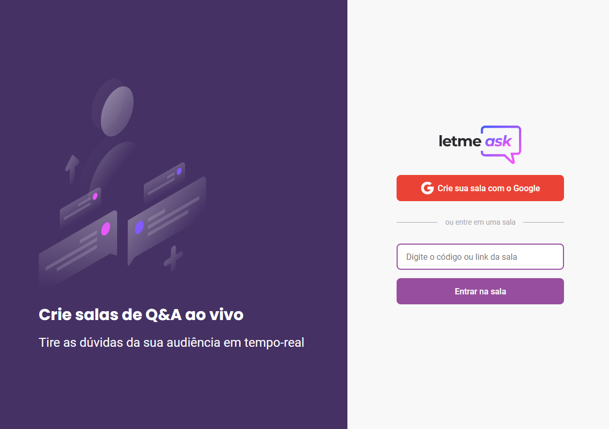
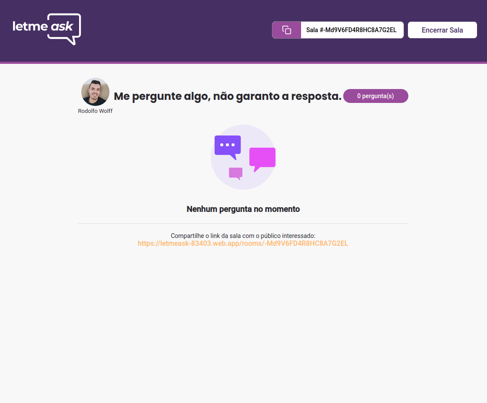

<h1 align="center">
  

</h1>

  <a href="#-tecnologias">Tecnologias</a>&nbsp;&nbsp;&nbsp;|&nbsp;&nbsp;&nbsp;
  <a href="#-projeto">Projeto</a>&nbsp;&nbsp;&nbsp;|&nbsp;&nbsp;&nbsp;
  <a href="#-novidades">Novidades</a>&nbsp;&nbsp;&nbsp;|&nbsp;&nbsp;&nbsp;
  <a href="#-layout">Layout</a>&nbsp;&nbsp;&nbsp;|&nbsp;&nbsp;&nbsp;
  <a href="https://letmeask-83403.web.app/rooms/-Md9V6FD4R8HC8A7G2EL">Visite o Site</a>

 

  

 

  

  

  

  

## ✨ Tecnologias

Esse projeto foi desenvolvido com as seguintes tecnologias:

- [React](https://reactjs.org)
- [TypeScript](https://www.typescriptlang.org/)
- [Firebase](https://firebase.google.com/)

## 💻 Projeto

O letmeask é um projeto para Criar salas de Q&A ao vivo e tirar as dúvidas da sua audiência em tempo-real

Se preferir acesse uma sala já criada: https://letmeask-83403.web.app/rooms/-Md9V6FD4R8HC8A7G2EL

## 📝 Novidades

    LAYOUT
        Add Responsividade
        Add styles na pasta respectivo componente
        Add Componente Loading
        Add Favicon
        Add Page 404 customizada Rocketseat. Adaptado para TSX e SCSS
        Add Variavel de cores (Primary e Secundary, Link)

    ROOMS
        Componente único de ROOMS compartilhado com ADMIN (aproveitamento de código)
        Rota ROOMS mesma Sala Admin (sem necessidade de redirecionamento)
        Quando Admin Encerra a sala - usuários são redirecionados automaticamente
        Add proteção Room Admin
        Add nome e avatar do author da sala
        Add instruções para compartilhar o link da sala
        Add login na sala
        Add like 👍 para Admin (porque não?)

    QUESTIONS
        Add componente isolado de ROOMS
        Altura mámima definida para cada question
        Scrool customizado quando ultrapassa altura maxima
        Icones de Opções ampliam e mudam de cor com mouse
        Limit de 1000 caracteres com contador para novas questões

    OUTROS
        add editorconfig
        add Prettierrc
        add componente ASIDE para Home e NewRoom
        add Hospedagem Vercel

---

Feito com ♥ by Rodolfo Wolff 👋🏻 [Projeto da semana NLW da Rocketseat](https://rocketseat.com.br/)
